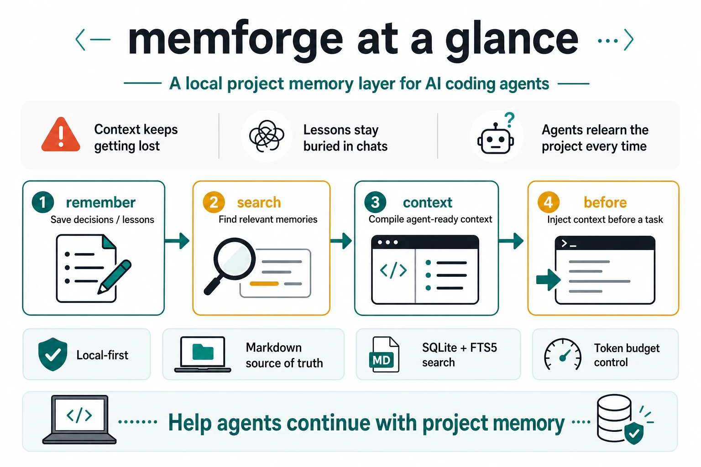

# MemForge

[中文](README.zh-CN.md)



MemForge is a local-first project memory layer for AI coding agents such as Claude Code, Codex, Cursor, and Gemini CLI.

It stores structured project memories on the user's machine, indexes them with SQLite + FTS5, and compiles agent-ready context within a token budget. Markdown remains the source of truth; the SQLite index is rebuildable.

## What it is

MemForge is a local project context compiler for AI coding workflows.

It is designed to help agents and developers keep durable project memory without polluting the working repository.

## What it is not

- Not a generic knowledge base
- Not a chat history archive
- Not a cloud memory service
- Not a repository auto-scanner
- Not an always-on background daemon

## Current status

This repository now has a working local-first MVP command path.

Implemented now:

- `version`
- `help`
- `init`
- `remember`
- `search`
- `context`
- `before`
- `after`
- `reindex`
- `mcp`
- `diff-summary`
- hybrid `search --hybrid`
- session adapters for `after --adapter`
- `debug paths`
- governance, harness, and GitHub workflow guardrails

## Installation

Choose one path based on how you want to use MemForge.

### 1. Claude Code plugin install

This is the recommended path for Claude Code users. Install the plugin from a Claude Code marketplace or release catalog:

```txt
/plugin marketplace add <marketplace-or-release-catalog>
/plugin install memforge@<marketplace-name>
/reload-plugins
```

The release plugin package includes platform-specific `memforge` runtime binaries and starts MCP through `bin/memforge-mcp-launcher.js`. You do not run `go install` first, and you do not need a separate `memforge` CLI on `PATH`.

### 2. Codex plugin install

> **Official Codex plugin store status:** OpenAI's self-serve plugin publishing is not yet available (marked "coming soon" in OpenAI docs as of May 2026). MemForge is not listed in the Codex official plugin browser (`/plugins`). When public publishing opens and MemForge is accepted, users will be able to install directly from the Codex plugin browser.

Until then, prefer a Git marketplace/catalog when testing or distributing Codex installs. Codex.app in-app upgrades are only supported for Git marketplace/catalog installs. Acceptance should prefer the Git marketplace install path so update behavior matches the user-facing distribution model.

**A. Git marketplace/catalog (preferred for acceptance and updates)**

The repository ships a Codex marketplace entry at `.agents/plugins/marketplace.json` and `marketplaces/codex/marketplace.json`. Add the Git marketplace/catalog from the repository URL or from a checkout that points Codex at the Git-backed entry:

```bash
codex plugin marketplace add https://github.com/MagnumGOYB/memforge
codex plugin add memforge@memforge-codex-marketplace
```

This is the preferred acceptance path because Codex.app can use the Git marketplace/catalog source for in-app upgrades.

**B. Local/private marketplace or Codex host plugin package**

When your Codex host supports local/private marketplace or plugin package installation, install the packaged `dist/plugins/codex/memforge` bundle through that host. The packaged bundle includes platform-specific `memforge` runtime binaries and uses `bin/memforge-mcp-launcher.js`; users should not need to preinstall the CLI.

For non-Git marketplace installs, the `check_update` MCP tool only detects newer releases and returns reinstall guidance. It does not promise Codex.app automatic upgrades.

**C. Direct MCP registration (recommended CLI fallback)**

```bash
go install github.com/MagnumGOYB/memforge/cmd/memforge@latest
codex mcp add memforge -- memforge --no-version-check mcp
```

This uses a `memforge` binary on `PATH` and is not the packaged plugin runtime path.

**D. Local marketplace discovery (development/debugging only)**

Codex CLI 0.132 exposes marketplace management and plugin install/remove commands. From a packaged checkout after `make package-plugins`:

```bash
codex plugin marketplace add "$PWD"
codex plugin add memforge@memforge-codex-marketplace
```

This installs the packaged bundle from `dist/plugins/codex/memforge`; it should start without a separate `memforge` binary on `PATH`.

See `docs/plugin-distribution.md` for detailed Claude Code and Codex distribution information.

### Manual plugin updates

Bundled plugin installs carry their own `memforge` runtime. Updating a separately installed CLI does not update an already installed plugin package.

For a Codex Git marketplace/catalog install, reinstall the plugin from the same marketplace entry:

```bash
codex plugin remove memforge
codex plugin add memforge@memforge-codex-marketplace
```

For a Codex local checkout marketplace install, refresh the checkout, rebuild the packaged bundle, and reinstall:

```bash
cd /path/to/memforge
git pull
make package-plugins
codex plugin remove memforge
codex plugin marketplace add "$PWD"
codex plugin add memforge@memforge-codex-marketplace
```

For a Claude Code local checkout marketplace install, refresh the checkout, rebuild the packaged bundle, reinstall, and reload plugins:

```bash
cd /path/to/memforge
git pull
make package-plugins
claude plugin marketplace add "$PWD"
claude plugin install memforge@memforge-marketplace
```

Then run in Claude Code:

```txt
/reload-plugins
```

For direct MCP registration, update the CLI binary on `PATH` instead:

```bash
MEMFORGE_VERSION=latest \
  curl -fsSL https://raw.githubusercontent.com/MagnumGOYB/memforge/main/scripts/install.sh | bash
```

### 3. CLI install

Install the latest release binary with curl:

```bash
curl -fsSL https://raw.githubusercontent.com/MagnumGOYB/memforge/main/scripts/install.sh | bash
```

The script installs to `$HOME/.local/bin` by default. Override the install directory or version when needed:

```bash
MEMFORGE_INSTALL_DIR="$HOME/bin" MEMFORGE_VERSION="latest" \
  curl -fsSL https://raw.githubusercontent.com/MagnumGOYB/memforge/main/scripts/install.sh | bash
```

The curl installer supports macOS and Linux on arm64 and amd64. For Windows, download a release asset manually or use the Go install path below.

Go install requirements:

- Go 1.26.3 or newer

Install the latest published module version:

```bash
go install github.com/MagnumGOYB/memforge/cmd/memforge@latest
```

Install from a local checkout:

```bash
git clone https://github.com/MagnumGOYB/memforge.git
cd memforge
make build
go install ./cmd/memforge
```

For agent and automation usage, set a local storage root explicitly:

```bash
export MEMFORGE_HOME="$HOME/.local/share/memforge"
```

## Quick start

Build the CLI:

```bash
make build
```

Run the current commands:

```bash
make run ARGS="version"
MEMFORGE_HOME=/absolute/path make run ARGS="init --format json --no-version-check"
MEMFORGE_HOME=/absolute/path make run ARGS="remember --kind decision --title 'Repository layer is framework-agnostic' --format json --no-version-check 'Body'"
MEMFORGE_HOME=/absolute/path make run ARGS="search --format json --no-version-check 'repository framework'"
MEMFORGE_HOME=/absolute/path make run ARGS="context --budget 3000 --format json --no-version-check"
MEMFORGE_HOME=/absolute/path make run ARGS="before --budget 3000 --format json --no-version-check 'Refactor repository layer'"
MEMFORGE_HOME=/absolute/path make run ARGS="after --from /absolute/path/session.md --format json --no-version-check"
MEMFORGE_HOME=/absolute/path make run ARGS="after --from /absolute/path/session.md --approve all --format json --no-version-check"
MEMFORGE_HOME=/absolute/path make run ARGS="reindex --format json --no-version-check"
MEMFORGE_HOME=/absolute/path make run ARGS="mcp --no-version-check"
MEMFORGE_HOME=/absolute/path make run ARGS="search --hybrid --format json --no-version-check 'repository framework'"
MEMFORGE_HOME=/absolute/path make run ARGS="after --adapter claude-code --from /absolute/path/session.jsonl --format json --no-version-check"
MEMFORGE_HOME=/absolute/path make run ARGS="diff-summary --from /absolute/path/numstat.txt --format json --no-version-check"
MEMFORGE_HOME=/absolute/path make run ARGS="debug paths --format json --no-version-check"
```

## Project configuration

`context`, `before`, and MCP context tools read optional TOML configuration from the user config file and project root:

```toml
default_budget = 1200

[kind_weights]
decision = 99
bugfix = 95
constraint = 100
```

Project `.memoryrc` overrides `$XDG_CONFIG_HOME/memforge/config.toml`. CLI `--budget` and MCP tool `budget` arguments override both. Configuration never stores memory content; memories still live only under `MEMFORGE_HOME` or `$XDG_DATA_HOME/memforge`.

## AI agent contract

For automation and agent-driven usage, prefer:

```bash
memforge --no-version-check <command> --format json
```

Rules:

- JSON payloads belong on stdout.
- Human-readable warnings belong on stderr.
- `--no-version-check` is part of the automation contract.

## Local-first and privacy boundaries

- Memories do not live in the user repository.
- Storage resolves under `MEMFORGE_HOME` or `$XDG_DATA_HOME/memforge`.
- Default behavior is local-first and offline.
- Markdown is canonical storage.
- SQLite is a rebuildable index layer.
- MVP commands do not make opt-in LLM/provider calls.
- `after` is proposal-first: it extracts candidate memories from an explicit session file and persists only when `--approve` is provided.
- Enabled MCP plugins may let the agent create or update stable project memories during a thread through `upsert_project_memory`; this still requires an explicit tool call, never auto-scans the repository, and never calls remote providers.
- Provider-backed extraction is opt-in and scoped to `after`; other commands stay local/offline.
- Hybrid search is explicit via `search --hybrid` and uses local deterministic embeddings by default.
- Session adapters and diff summaries are local transformations over explicitly supplied files or local git output.

## Development

Use the repository Makefile targets so Go caches stay inside `.cache/memforge` during local and agent-driven validation:

```bash
make setup
make check
make test
make test-packages PKGS="./internal/index ./internal/compiler"
make test-harness
make vet
make build
make validate
make validate-pr-body
```

## Open source project docs

- Contributor guide: `CONTRIBUTING.md` / `CONTRIBUTING.zh-CN.md`
- Agent execution guide: `AGENTS.md` / `AGENTS.zh-CN.md`
- Claude Code entrypoint: `CLAUDE.md` / `CLAUDE.zh-CN.md`
- Harness engineering: `docs/harness-engineering.md` / `docs/zh-CN/harness-engineering.md`
- GitHub automation: `docs/github-automation.md` / `docs/zh-CN/github-automation.md`
- Memory format: `docs/memory-format.md` / `docs/zh-CN/memory-format.md`
- MCP server: `docs/mcp.md` / `docs/zh-CN/mcp.md`
- Agent integrations: `docs/integrations.md` / `docs/zh-CN/integrations.md`
- Plugin distribution: `docs/plugin-distribution.md` / `docs/zh-CN/plugin-distribution.md`
- Plan: `plan.md` / `plan.zh-CN.md`

## Module path

```bash
go install github.com/MagnumGOYB/memforge/cmd/memforge@latest
```

For local development from this checkout:

```bash
go install ./cmd/memforge
```
