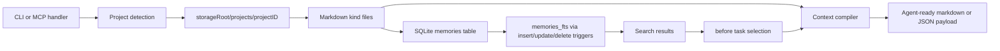

# Core Functional Flow

[中文](zh-CN/core-functional-flow.md)

This document is derived from source code only. It covers the core runtime path in `cmd/memforge` and `internal/*`; harness, CI, commitlint, version tooling, release tooling, and plugin packaging are outside this runtime flow.

## Core Scope

Core functions:

- CLI entry and command dispatch: `cmd/memforge/main.go`, `internal/cli/root.go`
- Base settings and storage root resolution: `internal/config/config.go`
- Project detection and deterministic project ID: `internal/project/*`
- Memory markdown creation, parsing, and loading: `internal/memory/*`
- SQLite/FTS5 index creation, upsert, search, and rebuild: `internal/index/*`
- Context compilation and token budgeting: `internal/compiler/*`
- Session candidate extraction and approval: `internal/after/*`, `internal/provider/provider.go`
- Stdio MCP server and tool handlers: `internal/mcp/server.go`, `internal/cli/mcp.go`

## End-to-End Flow

```mermaid
flowchart TD
  A["OS process: cmd/memforge/main.go"] --> B["cli.Execute(args, streams)"]
  B --> C["newRootCmd(streams)"]
  C --> D["Cobra parses persistent flags: --format, --no-version-check"]
  D --> E{"Subcommand"}

  E --> V["version"]
  V --> V1["config.LoadBase(cmd)"]
  V1 --> V2["buildinfo.Version()"]
  V2 --> OUT["write text or JSON to stdout"]

  E --> I["init"]
  E --> R["remember"]
  E --> S["search"]
  E --> Ctx["context"]
  E --> Bef["before"]
  E --> Aft["after"]
  E --> Re["reindex"]
  E --> M["mcp"]
  E --> DS["diff-summary"]
  E --> DP["debug paths"]

  I --> P0["shared project setup"]
  R --> P0
  S --> P0
  Ctx --> P0
  Bef --> P0
  Aft --> P0
  Re --> P0
  M --> P0
  DP --> P0

  P0 --> P1["config.LoadBase validates format text|json and MEMFORGE_NO_VERSION_CHECK"]
  P1 --> P2["config.ResolveStorageRoot: MEMFORGE_HOME, else XDG_DATA_HOME/memforge, else ~/.local/share/memforge"]
  P2 --> P3["project.Detect(--root)"]
  P3 --> P4["detectRoot: --root absolute path, else git rev-parse --show-toplevel, else cwd"]
  P4 --> P5["detectIdentifier: git remote.origin.url, else git root, else root"]
  P5 --> P6["CanonicalizeIdentifier: URL/SCP-like normalization and .git trim"]
  P6 --> P7["HashIdentifier: sha256(identifier) first 16 hex chars"]
  P7 --> P8["derivePaths(storageRoot, project): projects/<projectID>/{meta.json,schema_version,memories,index.sqlite,cache}"]

  I --> I1["mkdir project dir and cache dir"]
  I1 --> I2["memory.EnsureLayout creates kind markdown files"]
  I2 --> I3["write schema_version = index.CurrentSchemaVersion"]
  I3 --> I4["project.WriteMeta preserves created_at when meta exists"]
  I4 --> I5["index.Open creates/configures/migrates SQLite"]
  I5 --> OUT

  R --> R1["resolveRememberContent: exactly one of positional body, '-', or --from"]
  R1 --> R2["memory.ParseKind"]
  R2 --> R3["memory.NewRecord validates project_id, kind, title, content, confidence"]
  R3 --> R4["normalize CRLF/CR to LF, trim content, normalize/sort/dedupe tags"]
  R4 --> R5["generate ULID and UTC created_at/updated_at"]
  R5 --> PM["persistMemory"]

  Aft --> A1["read --from session file"]
  A1 --> A2["memory.EnsureLayout and memory.LoadRecords existing memories"]
  A2 --> A3["provider.Select: heuristic only unless configured provider requested"]
  A3 --> A4["after.ExtractSessionText: plain or JSONL adapters"]
  A4 --> A5["extract candidates from kind-prefixed blocks"]
  A5 --> A6["FindDuplicateCandidates by same kind and title/content similarity"]
  A6 --> A7["BuildMergeProposals by same kind plus title/tag overlap"]
  A7 --> A8["ApproveCandidates: none, all, or comma-separated IDs; duplicates skipped"]
  A8 --> PM

  PM --> PM1["memory.AppendMarkdown ensures layout"]
  PM1 --> PM2["append canonical block to kind file"]
  PM2 --> PM3["file.Sync()"]
  PM3 --> PM4["index.Open(index.sqlite)"]
  PM4 --> PM5["index.UpsertMemory in transaction"]
  PM5 --> PM6["SQLite triggers update memories_fts"]
  PM6 --> OUT

  S --> S1["index.Open"]
  S1 --> S2["SearchMemories builds FTS MATCH query from unicode tokens as quoted prefix terms"]
  S2 --> S3["query memories_fts joined to memories by rowid, filtered by project_id and optional kind"]
  S3 --> S4["scan rows, JSON-decode tags, parse RFC3339 timestamps, build snippet"]
  S4 --> S5["score by BM25 norm, kind weight, recency, usage_count, effective confidence"]
  S5 --> S6{"--hybrid?"}
  S6 -- "no" --> S7["sort by score, tie-break updated_at"]
  S6 -- "yes" --> S8["local deterministic embedding: FNV hashed 64-dim token vectors"]
  S8 --> S9["combine 70% search score + 30% cosine semantic score"]
  S9 --> S7
  S7 --> S10["CLI tag filter is applied after index search"]
  S10 --> OUT

  Ctx --> C1["memory.LoadRecords from all kind files"]
  C1 --> C2["parse --kinds into memory.Kind list"]
  C2 --> CC["compiler.CompileContext"]

  Bef --> B1["memory.LoadRecords"]
  B1 --> B2["index.Open and SearchMemories(task, limit=20)"]
  B2 --> B3["selectBeforeRecords"]
  B3 --> B4["always include manual and constraint records"]
  B4 --> B5["add FTS matches not already selected"]
  B5 --> B6["fallback term containment for task terms length >= 4"]
  B6 --> CC

  CC --> CC1["default budget 3000 when <= 0"]
  CC1 --> CC2["optional kind filter"]
  CC2 --> CC3["CountTokens via cl100k_base tokenizer or chars/4+8 fallback warning"]
  CC3 --> CC4["score records by fixed baseline, kind weight, recency, effective confidence"]
  CC4 --> CC5["sort by score, tie-break updated_at"]
  CC5 --> CC6["allocateBudget: priority manual/constraint up to 30%, then weighted kind quotas, then remaining fill"]
  CC6 --> CC7["render grouped markdown by first selected kind order"]
  CC7 --> OUT

  Re --> Re1["mkdir project dir and EnsureLayout"]
  Re1 --> Re2["memory.LoadRecords from markdown truth source"]
  Re2 --> Re3["index.Open"]
  Re3 --> Re4["index.RebuildMemories compares existing IDs and record IDs"]
  Re4 --> Re5["count orphans and ghosts"]
  Re5 --> Re6["DELETE all memories"]
  Re6 --> Re7["Upsert each parsed markdown record; FTS triggers replay"]
  Re7 --> OUT

  M --> M1["newProjectMCPServer(paths, project)"]
  M1 --> M2["mcp.Server.Serve line-delimited JSON-RPC over stdin/stdout"]
  M2 --> M3{"method"}
  M3 --> MI["initialize returns protocolVersion, tools capability, serverInfo"]
  M3 --> ML["tools/list returns declared tools"]
  M3 --> MC["tools/call dispatches by tool name"]
  MC --> MT1["search_memory -> index.SearchMemories"]
  MC --> MT2["compile_context -> Load project settings + memory.LoadRecords + compiler.CompileContext"]
  MC --> MT3["save_memory -> memory.NewRecord(source=mcp) + persistMemory"]
  MC --> MT3B["upsert_project_memory -> create/update by kind+title + rewrite kind markdown + rebuild index"]
  MC --> MT4["list_constraints -> LoadRecords and filter kind=constraint"]
  MC --> MT5["get_project_context -> load project settings + optional before-style selection + CompileContext"]
  MI --> MOUT["JSON-RPC response"]
  ML --> MOUT
  MT1 --> MOUT
  MT2 --> MOUT
  MT3 --> MOUT
  MT3B --> MOUT
  MT4 --> MOUT
  MT5 --> MOUT
  MOUT --> OUT

  DS --> DS1["read --from numstat file or run git diff --numstat"]
  DS1 --> DS2["parse added/deleted/path, treating '-' as 0"]
  DS2 --> DS3["sort summaries by path"]
  DS3 --> OUT

  DP --> DP1["return resolved storage and project paths"]
  DP1 --> OUT

  B -. "commandError" .-> ERR["exit code mapping"]
  ERR --> ERR1["invalidError -> 2"]
  ERR --> ERR2["userError -> 1"]
  ERR --> ERR3["internalError or unknown error -> 3"]
```

## Canonical Data Flow

## Source-Level Contracts

- `memory.AppendMarkdown` writes markdown first, then `persistMemory` opens SQLite and upserts the same record.
- `reindex` treats markdown as the rebuild source and deletes all SQLite `memories` rows before replaying parsed records.
- The SQLite schema uses external-content FTS5 with triggers: `memories_ai`, `memories_ad`, and `memories_au`.
- Search cannot run on an empty tokenized query because `buildMatchQuery` returns an empty expression and `SearchMemories` returns `query is required`.
- CLI JSON output is produced by `writeJSON` on stdout; command errors are printed to stderr by `Execute`.
- MCP tool-call results are JSON-encoded into a text content item inside the JSON-RPC response.
- `after` is proposal-first: candidates are persisted only when `--approve` allows them and duplicate candidate IDs are excluded.
- `context`, `before`, `compile_context`, and `get_project_context` read project/user configuration for default budget and kind weights; explicit CLI flags or MCP arguments win.
- `upsert_project_memory` is the MCP path for enabled-plugin memory maintenance. It updates by `kind` plus normalized `title` and then rebuilds the index from markdown.
- Provider-backed extraction is recognized but not configured in source; non-heuristic provider names currently return an invalid provider configuration error.
- Hybrid search is local only: it uses deterministic FNV-token embeddings and cosine reranking, with no provider call in the source path.
