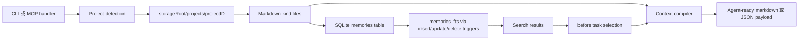

# 核心功能流程

[English](../core-functional-flow.md)

本文只根据源码整理。覆盖 `cmd/memforge` 与 `internal/*` 的核心运行链路；harness、CI、commitlint、version tooling、release tooling、plugin packaging 不属于这里的核心运行流程。

## 核心范围

核心功能：

- CLI 入口与命令分发：`cmd/memforge/main.go`、`internal/cli/root.go`
- 基础配置与存储根目录解析：`internal/config/config.go`
- 项目识别与确定性 project ID：`internal/project/*`
- Memory markdown 创建、解析、加载：`internal/memory/*`
- SQLite/FTS5 索引创建、upsert、搜索、重建：`internal/index/*`
- 上下文编译与 token budget：`internal/compiler/*`
- Session candidate 提取与确认写入：`internal/after/*`、`internal/provider/provider.go`
- stdio MCP server 与工具 handler：`internal/mcp/server.go`、`internal/cli/mcp.go`

## 端到端流程

```mermaid
flowchart TD
  A["OS process: cmd/memforge/main.go"] --> B["cli.Execute(args, streams)"]
  B --> C["newRootCmd(streams)"]
  C --> D["Cobra 解析 persistent flags: --format, --no-version-check"]
  D --> E{"Subcommand"}

  E --> V["version"]
  V --> V1["config.LoadBase(cmd)"]
  V1 --> V2["buildinfo.Version()"]
  V2 --> OUT["写 text 或 JSON 到 stdout"]

  E --> I["init"]
  E --> R["remember"]
  E --> S["search"]
  E --> Ctx["context"]
  E --> Bef["before"]
  E --> Aft["after"]
  E --> Re["reindex"]
  E --> M["mcp"]
  E --> DS["diff-summary"]
  E --> DP["debug paths"]

  I --> P0["共享项目初始化链路"]
  R --> P0
  S --> P0
  Ctx --> P0
  Bef --> P0
  Aft --> P0
  Re --> P0
  M --> P0
  DP --> P0

  P0 --> P1["config.LoadBase 校验 format=text|json，并读取 MEMFORGE_NO_VERSION_CHECK"]
  P1 --> P2["config.ResolveStorageRoot: MEMFORGE_HOME，否则 XDG_DATA_HOME/memforge，否则 ~/.local/share/memforge"]
  P2 --> VC["低频版本检查，除非 --no-version-check 或 MEMFORGE_NO_VERSION_CHECK=1"]
  VC --> P3["project.Detect(--root)"]
  P3 --> P4["detectRoot: --root 必须存在且是目录，否则 git rev-parse --show-toplevel，否则 cwd"]
  P4 --> P5["detectIdentifier: git remote.origin.url，否则 git root，否则 root"]
  P5 --> P6["CanonicalizeIdentifier: URL/SCP-like 归一化并去掉 .git"]
  P6 --> P7["HashIdentifier: sha256(identifier) 前 16 位 hex"]
  P7 --> P8["derivePaths(storageRoot, project): projects/<projectID>/{meta.json,schema_version,memories,index.sqlite,cache}"]

  I --> I1["mkdir project dir 和 cache dir"]
  I1 --> I2["memory.EnsureLayout 创建 kind markdown 文件"]
  I2 --> I3["写 schema_version = index.CurrentSchemaVersion"]
  I3 --> I4["project.WriteMeta；meta 已存在时保留 created_at"]
  I4 --> I5["index.Open 创建、配置、迁移 SQLite"]
  I5 --> OUT

  R --> R1["resolveRememberContent: positional body、'-'、--from 三选一且只能一个"]
  R1 --> R2["memory.ParseKind"]
  R2 --> R3["memory.NewRecord 校验 project_id、kind、title、content、confidence"]
  R3 --> R4["CRLF/CR 归一为 LF，trim content，tag 去空、去重、排序"]
  R4 --> R5["生成 ULID 与 UTC created_at/updated_at"]
  R5 --> PM["persistMemory"]

  Aft --> A1["读取 --from session file"]
  A1 --> A2["memory.EnsureLayout 并 memory.LoadRecords 加载已有 memory"]
  A2 --> A3["provider.Select: 默认 heuristic；未配置 provider 会报错"]
  A3 --> A4["after.ExtractSessionText: plain、宽松 jsonl，或按 role/message 过滤的 agent adapters"]
  A4 --> A5["从 kind-prefixed blocks 提取 candidates"]
  A5 --> A6["FindDuplicateCandidates: 同 kind 且 title/content 高相似"]
  A6 --> A7["BuildMergeProposals: 同 kind 且 title/tag overlap"]
  A7 --> A8["ApproveCandidates: none、all 或逗号分隔 ID；duplicate 会跳过"]
  A8 --> PM

  PM --> PM1["memory.AppendMarkdown 先 EnsureLayout"]
  PM1 --> PM2["append canonical block 到 kind 文件"]
  PM2 --> PM3["file.Sync()"]
  PM3 --> PM4["index.Open(index.sqlite)"]
  PM4 --> PM5["index.UpsertMemory 在事务内 upsert；index 失败降级为 warning，因为 markdown 是真值源"]
  PM5 --> PM6["SQLite triggers 同步 memories_fts"]
  PM6 --> OUT

  S --> S1["index.Open"]
  S1 --> S2["SearchMemories 将 unicode tokens 构造成 quoted prefix FTS MATCH query"]
  S2 --> S3["查询 memories_fts，并按 rowid join memories；过滤 project_id 与可选 kind"]
  S3 --> S4["扫描 rows、JSON 解析 tags、解析 RFC3339 时间、构建 UTF-8-safe snippet"]
  S4 --> S5["按 BM25 归一值、kind weight、recency、usage_count、effective confidence 计分"]
  S5 --> S6{"--hybrid?"}
  S6 -- "no" --> S7["按 score 排序，分数相同按 updated_at"]
  S6 -- "yes" --> S8["本地 deterministic embedding: FNV hashed 64-dim token vectors"]
  S8 --> S9["70% search score + 30% cosine semantic score"]
  S9 --> S7
  S7 --> OUT

  Ctx --> C1["memory.LoadRecords 从所有 kind 文件加载"]
  C1 --> C2["将 --kinds 解析为 memory.Kind 列表"]
  C2 --> CC["compiler.CompileContext"]

  Bef --> B1["memory.LoadRecords"]
  B1 --> B2["index.Open 并 SearchMemories(task, limit=20)"]
  B2 --> B3["selectBeforeRecords"]
  B3 --> B4["始终包含 manual 与 constraint records"]
  B4 --> B5["追加尚未选中的 FTS matches"]
  B5 --> B6["fallback: task term 长度 >= 4 时做 title/content/tags 包含匹配"]
  B6 --> CC

  CC --> CC1["budget <= 0 时默认 3000"]
  CC1 --> CC2["可选 kind filter"]
  CC2 --> CC3["CountTokens 使用 cl100k_base；不可用时 chars/4+8 fallback 并产生 warning"]
  CC3 --> CC4["按固定 baseline、kind weight、recency、effective confidence 为 records 计分"]
  CC4 --> CC5["按 score 排序，分数相同按 updated_at"]
  CC5 --> CC6["allocateBudget: manual/constraint 优先最多 30%，再按 kind 权重 quota，最后剩余填充"]
  CC6 --> CC7["按首次选中 kind 顺序渲染分组 markdown"]
  CC7 --> OUT

  Re --> Re1["mkdir project dir 并 EnsureLayout"]
  Re1 --> Re2["memory.LoadRecords 从 markdown 真值源读取"]
  Re2 --> Re3["index.Open"]
  Re3 --> Re4["index.RebuildMemories 对比现有 ID 与 markdown record ID"]
  Re4 --> Re5["统计 orphans 与 ghosts"]
  Re5 --> Re6["在 rebuild transaction 内 DELETE all memories"]
  Re6 --> Re7["逐条 Upsert parsed markdown record；FTS triggers 重新回放"]
  Re7 --> OUT

  M --> M1["newProjectMCPServer(paths, project)"]
  M1 --> M2["mcp.Server.Serve 通过 stdin/stdout 处理 line-delimited JSON-RPC"]
  M2 --> M3{"method"}
  M3 --> MI["initialize 返回 protocolVersion、tools capability、serverInfo"]
  M3 --> ML["tools/list 返回声明的 tools"]
  M3 --> MC["tools/call 按 tool name dispatch"]
  MC --> MT1["search_memory -> index.SearchMemories"]
  MC --> MT2["compile_context -> memory.LoadRecords + compiler.CompileContext"]
  MC --> MT3["save_memory -> memory.NewRecord(source=mcp) + persistMemory"]
  MC --> MT4["list_constraints -> LoadRecords 并过滤 kind=constraint"]
  MC --> MT5["get_project_context -> 可选 before-style selection + CompileContext"]
  MI --> MOUT["JSON-RPC response"]
  ML --> MOUT
  MT1 --> MOUT
  MT2 --> MOUT
  MT3 --> MOUT
  MT4 --> MOUT
  MT5 --> MOUT
  MOUT --> OUT

  DS --> DS1["读取 --from numstat 文件，或运行 git diff --numstat"]
  DS1 --> DS2["解析 added/deleted/path；'-' 按 0"]
  DS2 --> DS3["summaries 按 path 排序"]
  DS3 --> OUT

  DP --> DP1["返回 resolved storage 与 project paths"]
  DP1 --> OUT

  B -. "commandError" .-> ERR["exit code mapping"]
  ERR --> ERR1["invalidError -> 2"]
  ERR --> ERR2["userError -> 1"]
  ERR --> ERR3["internalError 或 unknown error -> 3"]
```

## Canonical Data Flow

## 源码级契约

- `memory.AppendMarkdown` 先写 markdown，随后 `persistMemory` 打开 SQLite 并 upsert 同一条 record。
- `reindex` 以 markdown 为重建来源，先删除 SQLite `memories` 全部 rows，再回放 parsed records。
- SQLite schema 使用 external-content FTS5，并通过 `memories_ai`、`memories_ad`、`memories_au` 三个 trigger 同步。
- 空 token query 不能搜索：`buildMatchQuery` 返回空表达式，`SearchMemories` 返回 `query is required`。
- CLI JSON output 由 `writeJSON` 写 stdout；命令错误由 `Execute` 写 stderr。
- MCP `tools/call` 的 result 会先 JSON encode，再放进 JSON-RPC response 的 text content item。
- `after` 是 proposal-first：只有 `--approve` 允许且不属于 duplicate 的 candidate 才会持久化。
- Provider extraction 在源码里只识别但未配置；非 heuristic provider 当前会返回 invalid provider configuration error。
- Hybrid search 只走本地逻辑：FNV-token embedding + cosine rerank，源码路径没有 provider call。
